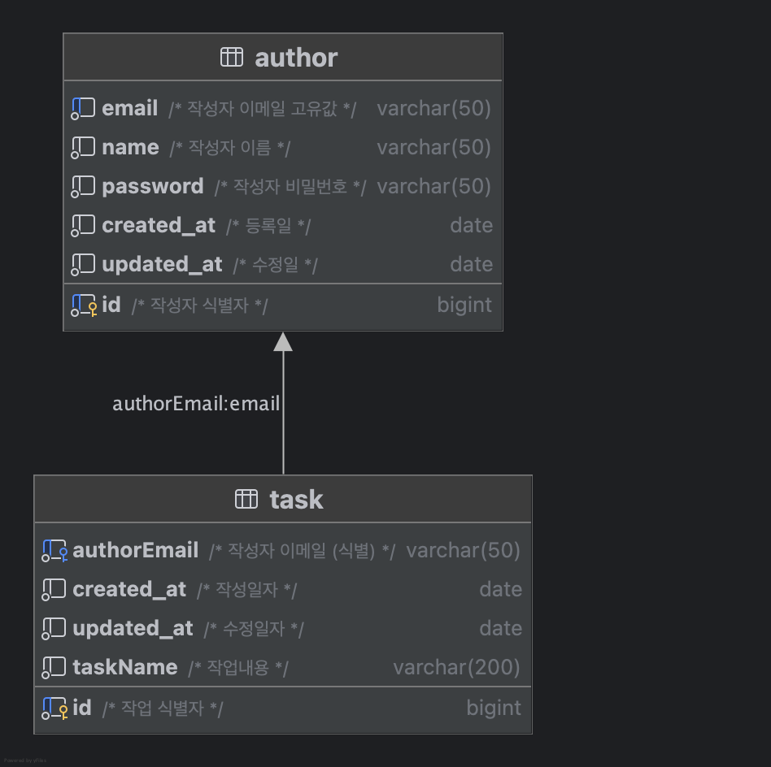

## 프로젝트 개요

### 프로젝트 : 일정관리 API 만들기

### 프로젝트 목적

- 스프링 기초 학습
- 스프링 MVC 기본적인 패턴 익히기
- CRUD 구현
- JDBC를 활용한 데이터베이스 연동

### 기술 스택

- Spring MVC
- JDBC
- MySQL

### 기능 요구사항

- 일정 생성
- 전체 일정 조회
- 선택 일정 조회
- 선택 일정 수정
- 선택 일정 삭제
- 전체 일정 조회(페이지)

---

### ERD

### API 명세

https://www.notion.so/1bc87841dba78043a012e4183b689159?v=1bc87841dba7804caa32000c68ab7756&pvs=4
